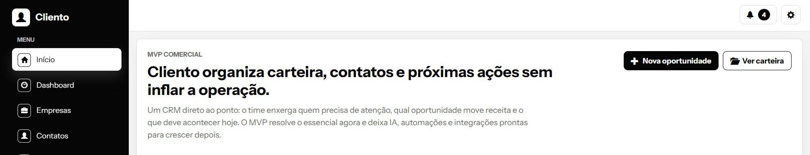
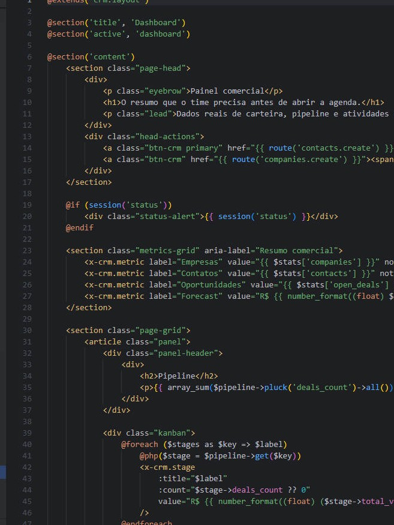
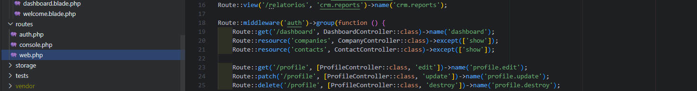

  

###

<h2 align="center">Jhuan Nohl</h2>

###

Web Developer

###

<h2 align="left">Sobre:</h2>

Atualmente sou estudante de Ciências da Computação, e trabalho profissionalmente na area de Tecnologia da Informacao. Tenho experiencia em suporte tecnico, infraestrutura de redes, sistemas corporativos, suporte ao usuário, análise de problemas e ambientes corporativos.  Tenho interesse em desenvolvimento de software, e venho construindo minha base técnica e prática em logica de programação, análise de dados, banco de dados e fundamentos de desenvolvimento web. Gosto de aprender na prática, entender como as soluções funcionam e transformar estudos em projetos reais.

###

 

<h2 align="left">Tecnologias e Ferramentas:</h2>

  
  
  
  
  
  
  
  
  
  
  
  
  
  
  
  
  
  
  
  
  
  
  
  
  

###

<h2 align="left">Estatísticas:</h2>

  

###

  

###

<h2 align="left">Contatos:</h2>

  
  
  &nbsp;&nbsp;&nbsp;
  
  &nbsp;&nbsp;&nbsp;
  
  

###

  

###
---
